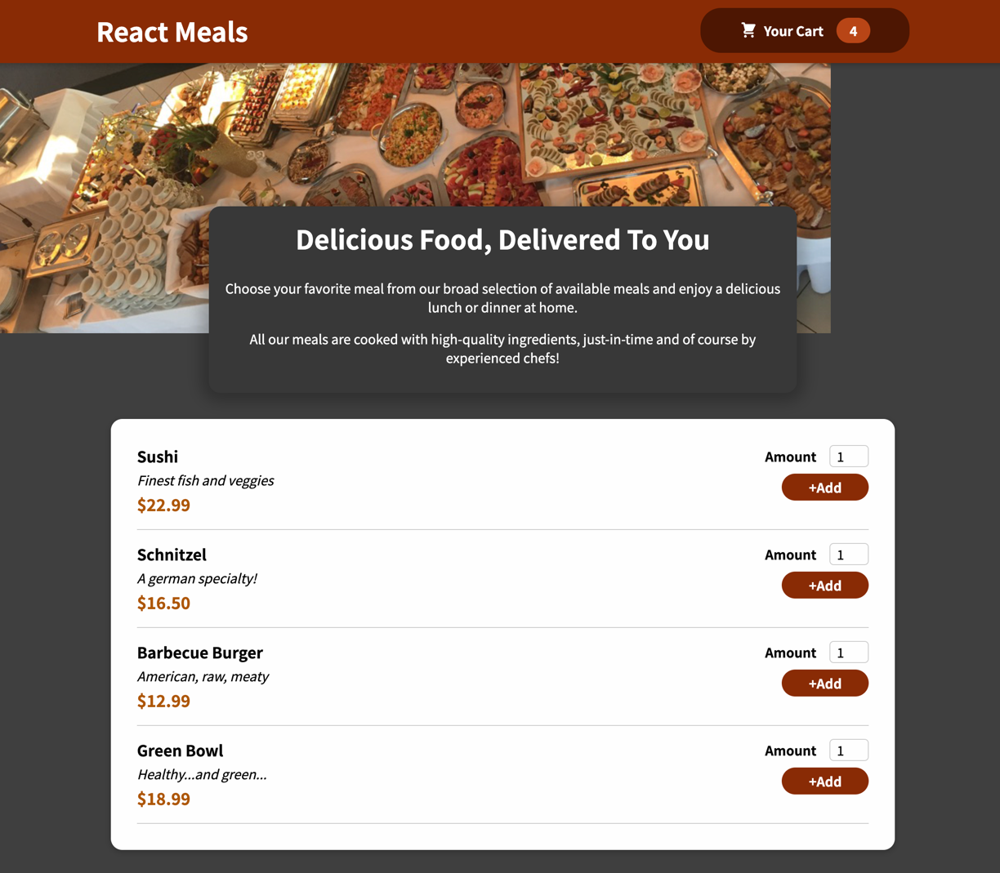
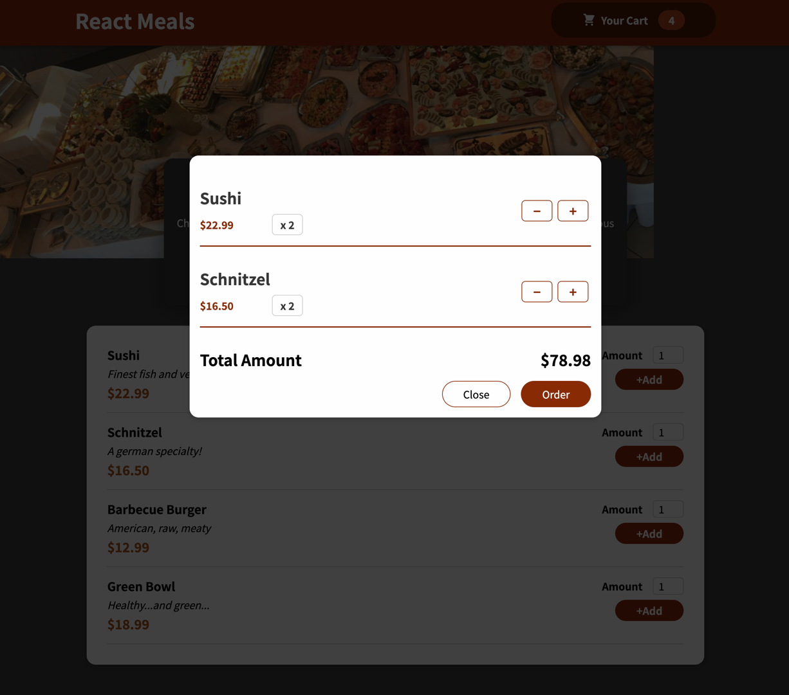

This is a short Single-Page App project to practice some React.js fundamentals:

<ul>
<li>useState</li>
<li>useEffect</li>
<li>useReducer</li>
<li>useContext</li>
<li>Portals / Refs</li>
</ul>

The app simulates an online food-ordering service. Meals are displayed in a list view with a simple form to allow users to add any number of desired meal-items to the cart. 

The cart displays each unique item, the amount ordered, the individual item-price, and the total amount. There are also buttons  next to each meal-item in the cart that allows the user to add or subtract items from the cart-modal (subtracting when the amount is 1 will remove the item entirely from the list).

The cart functionality is primarily implemented using `useContext()`, and `useReducer()` is utilized to dispatch the user-actions.